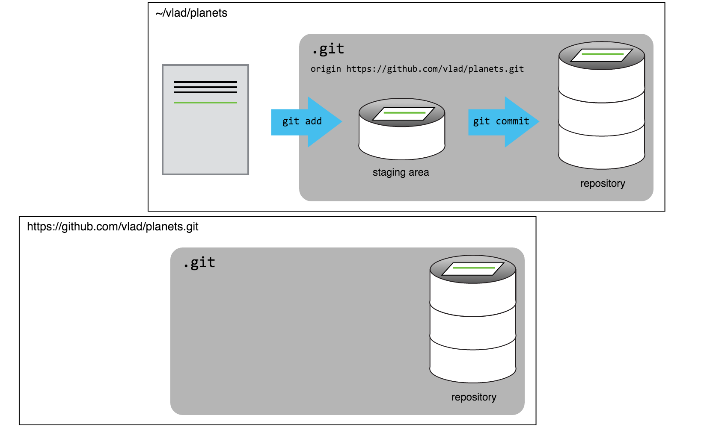

# 2015-11-17 CoDiMa workshop: git

----

Please use the EtherPad to take communal notes:

[http://pad.software-carpentry.org/2015-11-16-manchester-codima](http://pad.software-carpentry.org/2015-11-16-manchester-codima)

---

## Exploring history

----

### Git checkout

----

### How git works

----

### Question

- Which commands below will let Jennifer recover the last committed version of her Python script called `data_cruncher.py`?

1. `$ git checkout HEAD`
2. `$ git checkout HEAD data_cruncher.py`
3. `$ git checkout HEAD~1 data_cruncher.py`
4. `$ git checkout <unique ID of last commit> data_cruncher.py`

---

## Remotes in GitHub

----

### A freshly-made GitHub repository

----

### GitHub repo after first push

---

## GitHub collaboration

----

### What Vlad sees

----

### What Wolfman sees

---

## Git conflicts

----

### The conflicting changes

---

## Open Science

----

### Personal example 1

- Supplementary information from a paper published in 2014 on GitHub

[https://github.com/widdowquinn/SI_Pritchard_Birch_2014](https://github.com/widdowquinn/SI_Pritchard_Birch_2014)

----

### Repository contents

- Model description: `toy_plant_immune_system.cps`
- Results files: `*.txt`
- File to reproduce publication figures: `generate_graphs.Rmd`
- Publication figures: `*.pdf`

----

### Personal examples 2 & 3

- Supplementary info from a paper published in 2012

[http://figshare.com/articles/An_RxLR_Effector…](http://figshare.com/articles/An_RxLR_Effector_from_Phytophthora_infestans_Prevents_Re_localisation_of_Two_Plant_NAC_Transcription_Factors_from_the_Endoplasmic_Reticulum_to_the_Nucleus/819229)

- Dataset from a paper published in 2008

[http://figshare.com/articles/_Microarray_Analysis…](http://figshare.com/articles/_Microarray_Analysis_of_Selected_P_atrosepticum_Genes_in_planta_/599101)

----

### Personal examples 4 & 5

- Software libraries on GitHub

[pyADHoRe](https://github.com/widdowquinn/pyADHoRe)

[pyani](https://github.com/widdowquinn/pyani)

