# Introduction

## Goal 1

* **To learn the basic concepts of programming**

We use `Python` for this:

* we need *something* ;)
* free, well-documented, cross-platform
* widely-used

**Use what your colleagues (tend to) use**

## Goal 2

* **To analyse and visualise experimental data**

* Effectiveness of a new treatment for arthritis
* Several patients, recording inflammation on each day
* Tabular (comma-separated) data

**We can do this with a little programming**

* Why programming? **AUTOMATION**

# Setup

## Setting up - 1

Before we begin… 

* **make a neat working environment**
* obtain data

```bash
cd ~/Desktop
mkdir python-novice-inflammation
cd python-novice-inflammation
```

**LIVE DEMO**

## Setting up - 2

Before we begin… 

* make a neat working environment
* **obtain data**

```bash
cp 2017-03-23-standrews/lessons/python-01/data/python-novice-inflammation-data.zip ./
cp 2017-03-23-standrews/lessons/python-01/data/python-novice-inflammation-code.zip ./
unzip python-novice-inflammation-data.zip
unzip python-novice-inflammation-code.zip
```

(you can download files via [`Etherpad`](http://pad.software-carpentry.org/2017-03-23-standrews))

([http://pad.software-carpentry.org/2017-03-23-standrews](http://pad.software-carpentry.org/2017-03-23-standrews))

**LIVE DEMO**

# Getting Started

## Starting `Jupyter`

At the command-line, start `Jupyter` notebook:

```bash
jupyter notebook
```

## `Jupyter` landing page


## Create a new notebook


## My first notebook

* Give your notebook a name (`variables`)


## Cell types

* `Jupyter` documents are comprised of *cells*
* A `Jupyter` cell can have one of several types

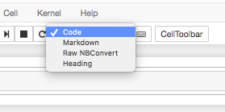

* Change the first cell to `Markdown`

## Markdown text

* `Markdown` allows us to enter formatted text.


* Execute a cell with `Shift + Enter`


## Entering code

* Mathematical statements can be entered directly into a code cell

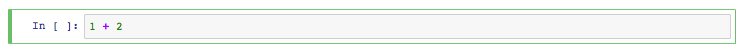

* Execute a cell with `Shift + Enter`

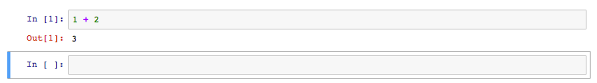

##  Exercise 01 (5min)

* Try out some of your own calculations in code cells, e.g.

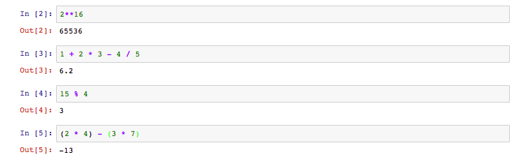

## My first variable

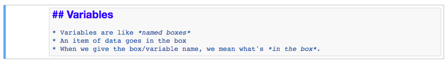


* Let's create a variable called `name`, containing `"Samia"`

## Printing a variable

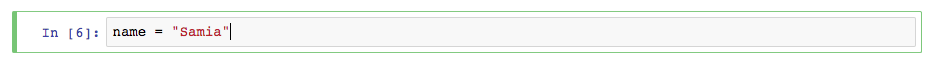

* The `print()` *function* shows the contents of a variable

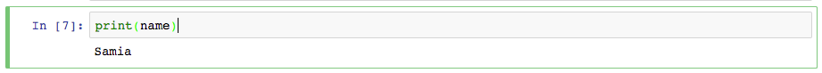


## Working with variables

```python
weight_kg = 55
print(weight_kg)
2.2 * weight_kg
print("weight in pounds", 2.2 * weight_kg)
weight_kg = 57.5
print("weight in kilograms is now:", weight_kg)
weight_lb = 2.2 * weight_kg
print('weight in kilograms:', weight_kg, 'and in pounds:', weight_lb)
weight_kg = 100
print('weight in kilograms:', weight_kg, 'and in pounds:', weight_lb)
```

* **LIVE DEMO**

##  Exercise 02 (5min)

What are the values in `mass` and `age` after the following code is executed?

```python
mass = 47.5
age = 122
mass = mass * 2.0
age = age - 20
```

1. `mass == 47.5`, `age == 122`
2. `mass == 95.0`, `age == 102`
3. `mass == 47.5`, `age == 102`
4. `mass == 95.0`, `age == 122`

##  Exercise 03 (5min)

What does the following code print out?

```python
first, second = 'Grace', 'Hopper'
third, fourth = second, first
print(third, fourth)
```

1. `Hopper Grace`
2. `Grace Hopper`
3. `"Grace Hopper"`
4. `"Hopper Grace"`

## Who's who in memory?

* **If you are in a `Jupyter` notebook or `iPython` terminal…**
* `%whos` will show you all defined variables

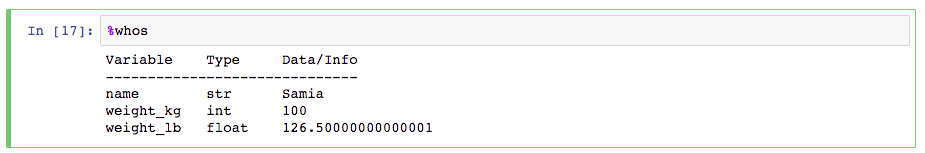


# Data Analysis

## Start a new notebook


* Add a header

## Examine the data

* `data/inflammation-01.csv`

```bash
$ head data/inflammation-01.csv 
0,0,1,3,1,2,4,7,8,3,3,3,10,5,7,4,7,7,12,18,6,13,11,11,7,7,4,6,8,8,4,4,5,7,3,4,2,3,0,0
0,1,2,1,2,1,3,2,2,6,10,11,5,9,4,4,7,16,8,6,18,4,12,5,12,7,11,5,11,3,3,5,4,4,5,5,1,1,0,1
0,1,1,3,3,2,6,2,5,9,5,7,4,5,4,15,5,11,9,10,19,14,12,17,7,12,11,7,4,2,10,5,4,2,2,3,2,2,1,1
0,0,2,0,4,2,2,1,6,7,10,7,9,13,8,8,15,10,10,7,17,4,4,7,6,15,6,4,9,11,3,5,6,3,3,4,2,3,2,1
0,1,1,3,3,1,3,5,2,4,4,7,6,5,3,10,8,10,6,17,9,14,9,7,13,9,12,6,7,7,9,6,3,2,2,4,2,0,1,1
0,0,1,2,2,4,2,1,6,4,7,6,6,9,9,15,4,16,18,12,12,5,18,9,5,3,10,3,12,7,8,4,7,3,5,4,4,3,2,1
0,0,2,2,4,2,2,5,5,8,6,5,11,9,4,13,5,12,10,6,9,17,15,8,9,3,13,7,8,2,8,8,4,2,3,5,4,1,1,1
0,0,1,2,3,1,2,3,5,3,7,8,8,5,10,9,15,11,18,19,20,8,5,13,15,10,6,10,6,7,4,9,3,5,2,5,3,2,2,1
0,0,0,3,1,5,6,5,5,8,2,4,11,12,10,11,9,10,17,11,6,16,12,6,8,14,6,13,10,11,4,6,4,7,6,3,2,1,0,0
0,1,1,2,1,3,5,3,5,8,6,8,12,5,13,6,13,8,16,8,18,15,16,14,12,7,3,8,9,11,2,5,4,5,1,4,1,2,0,0
```

* Plain text, comma-separated
* To load it, use `numpy` library

## `Python` libraries

* `Python` contains many powerful, general tools
* Specialised tools are contained in *libraries*
* We call on libraries, when needed
* Libraries are loaded with `import`

```python
import numpy
import seaborn
```

## `JUPYTER` MAGIC

* Another way to get use of some libraries in `Jupyter` is through *magic*

```python
%pylab inline
import numpy
import seaborn
```

* **This only works in `Jupyter` notebooks**


## `numpy`, `seaborn`, `pylab`

* `numpy`: work with matrices and arrays in `Python`
* `seaborn`: attractive statistical summary graphs
* `pylab`: numerical operations and visualisation in `Python`

* Calling `%pylab inline` shows graphics within the notebook itself

## Load data

* `numpy` provides a function `loadtxt()` to load tabular data:

```python
numpy.loadtxt(fname='data/inflammation-01.csv', delimiter=',')
```
* *dotted notation* tells us `loadtxt()` belongs to `numpy`
* `fname`: an *argument* expecting the path to a file
* `delimiter`: an *argument* expecting the character that separates columns

## Loaded data

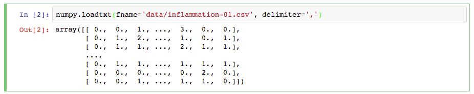

* The matrix is truncated to fit the screen
* `...` indicate missing rows or columns
* If there are no significant digits, they are not shown (`1 == 1. == 1.0`)
* **Assign the matrix to a variable called `data`**

## What is our data?

```python
type(data)
print(data.dtype)
print(data.shape)
```

**LIVE DEMO**

## Members and attributes

* Creating the array created information, too
* Info stored in *members* or *attributes* that belong to `data`
* `data.<attribute>` e.g. `data.shape`

## Indexing arrays

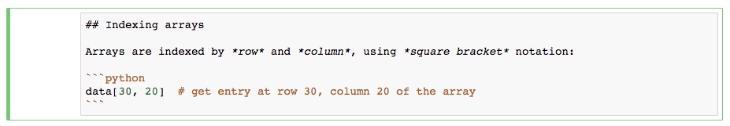

* Counting of array elements **starts at zero**, not at one.

```python
print('first value in data:', data[0, 0])
print('middle value in data:', data[30, 20])
```

**LIVE DEMO**

## Slicing arrays

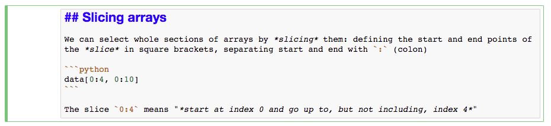

* Define *start* and *end* separated by `:` (colon).

```python
print(data[0:4, 0:10])
print(data[5:10, 0:10])
```

**LIVE DEMO**

## More slices, please!

* Don't specify *start*, `Python` assumes the first element
* Don't specify *end*, `Python` assumes the end element

**QUESTION:** What would `:` on its own indicate?

```python
small = data[:3, 36:]
print('small is:')
print(small)
```

**LIVE DEMO**

##  Exercise 04 (5min)

We can take slices of any series, not just arrays.

```python
element = 'oxygen'
print('first three characters:', element[0:3])
first three characters: oxy
```

What is the value of `element[:4]`?

1. `oxyg`
2. `gen`
3. `oxy`
4. `en`

## Array operations

* `array`s know how to perform operations on their values
* `+`, `-`, `*`, `/`, etc. are *elementwise*

```python
doubledata = data * 2.0
print('original:')
print(data[:3, 36:])
print('doubledata:')
print(doubledata[:3, 36:])
tripledata = doubledata + data
print('tripledata:')
print(tripledata[:3, 36:])
```

**LIVE DEMO**

## `numpy` functions

* `numpy` provides functions to operate on arrays

```python
print(numpy.mean(data))
maxval, minval, stdval = numpy.max(data), numpy.min(data), numpy.std(data)
print('maximum inflammation:', maxval)
print('minimum inflammation:', minval)
print('standard deviation:', stdval)
maxval, minval, stdval = data.max(), data.min(), data.std()
print('maximum inflammation:', maxval)
print('minimum inflammation:', minval)
print('standard deviation:', stdval)
```

* By default, these give summaries of the whole array.

**LIVE DEMO**

## Summary by patient

* Extract a single row, or operate directly on a row

```python
patient_0 = data[0, :] # Row zero only, all columns
print('maximum inflammation for patient 0:', patient_0.max())
print('maximum inflammation for patient 0:', numpy.max(data[0, :]))
print('maximum inflammation for patient 2:', numpy.max(data[2, :]))
```

**LIVE DEMO**

## Summary of all patients

* What if we need maximum inflammation for each patient or average inflammation on each day?
* One line per patient/per day? Tedious. Prone to errors/typos.


## `numpy` operations on axes

* `numpy` functions take an `axis=` parameter: `0` (columns) or `1` (rows)

```python
print(numpy.max(data, axis=1))
print(data.mean(axis=0))
```

**LIVE DEMO**

# VISUALISATION

## Visualisation


* Visualisation deserves a course to itself
* Here's one I prepared earlier (for the [Software Sustainability Institute](https://www.software.ac.uk/)):

* [https://github.com/widdowquinn/Teaching-Data-Visualisation](https://github.com/widdowquinn/Teaching-Data-Visualisation)

## `matplotlib`

* `matplotlib` is the *de facto* standard plotting library in `Python`
* we `import`ed `seaborn` earlier, which makes `matplotlib` output nicer
* we used `%pylab inline` earlier, which puts `matplotlib` output in the notebook

```python
import matplotlib.pyplot
image = matplotlib.pyplot.imshow(data)
```

**LIVE DEMO**

## `matplotlib` `.imshow()`

* `.imshow()` renders matrix values as an image
* small values are white, large values are black
* inflammation rises and falls over a 40-day period

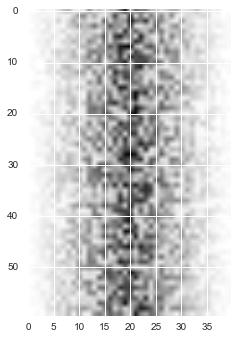

## `matplotlib` `.plot()`

* `.plot()` renders a line graph
* Plot the average inflammation level on each day

```python
ave_inflammation = numpy.mean(data, axis=0)
ave_plot = matplotlib.pyplot.plot(ave_inflammation)
```

* **QUESTION: does this look reasonable?**

**LIVE DEMO**

## Investigating data

* The plot of `.mean()` looks artificial
* Look at other statistics to gain insight

```python
max_plot = matplotlib.pyplot.plot(numpy.max(data, axis=0))
min_plot = matplotlib.pyplot.plot(numpy.min(data, axis=0))
```

* **QUESTION: does this look reasonable?**

**LIVE DEMO**

##  Exercise 05 (10min)

Can you create a plot showing the standard deviation (`numpy.std()`) of the inflammation data for each day across all patients?

## Figures and subplots

* We can put all three plots into a single *figure*
* We create a *figure* with `fig = matplotlib.pyplot.figure()`
* We add subplots with `ax = fig.add_subplot()`
* We set labels with `ax.set_ylabel()`
* We plot data with `ax.plot()`

**LIVE DEMO**

##  Exercise 06 (10min)

Can you modify the last plot to display the three graphs on top of one another, instead of side by side?

# LOOPS

## Start a new notebook


* Add a header

## Motivation


* We wrote some code that plots values of interest from a dataset
* **BUT** we're soon going to receive *dozens* of datasets to plot
* So: `for` loops

## Spelling Bee

* Suppose we want to spell a word, one letter at a time

```python
word = "lead"
print(word[0])
print(word[1])
print(word[2])
print(word[3])
```

* **QUESTION:** Why is this not a good approach?

**LIVE DEMO**

## `for` loops

* `for` loops perform actions *for* every item *in* a collection

```python
word = "lead"
for char in word:
    print(char)
```

**LIVE DEMO**

## Building `for` loops

* The general loop syntax is

```python
for element in collection:
    <do things with element>
```

* The `for` loop statement ends in a colon, `:`
* The *code block* is **indented** with a `tab` (`\t`)

## `for` loop cycles


## Counting things

```python
length = 0
for vowel in 'aeiou':
    length = length + 1
print('There are', length, 'vowels')
```

* **QUESTION:** What output does this program give you?

**LIVE DEMO**

## Loop variables

* The *loop variable* is updated on each cycle
* It keeps its value when the loop is finished

```python
letter = 'z'
for letter in 'abc':
    print(letter)
print('after the loop, letter is', letter)
```

**LIVE DEMO**

## `range()`

* The `range()` function creates a sequence of numbers
* It returns a `range` type that can be iterated over.

```python
range(3)
range(2, 5)
range(3, 10, 3)
for val in range(3, 10, 3):
    print(val)
```

**LIVE DEMO**

##  Exercise 07 (5min)

* Exponentiation is a `Python` built-in: `print(5 ** 3)`

Can you use a `for` loop to calculate `5 ** 3` using *only multiplication*?

##  Exercise 08 (5min)

* Can you write a loop that takes a string, e.g. `Newton`, and produces a new string with the characters in reverse order, e.g. `notweN`?


## `enumerate()`

* The `enumerate()` function creates paired indices and values for elements of a sequence

```python
enumerate("aeiou")
for idx, val in enumerate("aeiou"):
    print(idx, val)
```

##  Exercise 09 (5min)

* Can you write a loop using enumerate that solves the equation

$$y = a_0 + a_1 x + a_2 x^2 + a_3 x^3 + a_4 x^4$$

* for $x=5$ when given the coefficients as a list: `coeffs = [2, 4, 3, 2, 1]`

# LISTS

## Start a new notebook


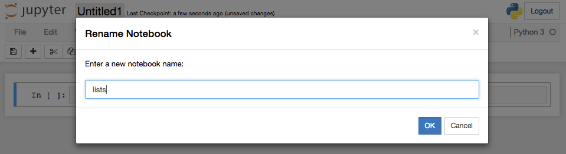

* Add a header

## Lists

* `list`s are a built in `Python` datatype
* Square brackets, comma-separated
* Indexed and sliced like arrays
* They are *iterable* lists of values

```python
odds = [1, 3, 5, 7]
print('odds are:', odds)
print('first and last:', odds[0], odds[-1])
for number in odds:
    print(number)
```

**LIVE DEMO**

## Mutability

* `list`s, like `string`s, are sequences
* **BUT** `list` elements can be changed: `list`s are *mutable*
* `string`s are not *mutable*

```python
names = ['Newton', 'Darwing', 'Turing'] # typo in Darwin's name
print('names is originally:', names)
names[1] = 'Darwin' # correct the name
print('final value of names:', names)
name = 'Darwin'
name[0] = 'd'
```

## Changer danger

* There are risks to modifying `list`s in-place

```python
my_list = [1, 2, 3, 4]
your_list = my_list
my_list[1] = 0
print("my list:", my_list)
print("your list:", your_list)
```

**LIVE DEMO**

* **QUESTION:** What is the value of `your_list`?

## `list` copies

* To avoid this kind of effect, you can make a *copy* of a `list` by *slicing* it or using the `list()` function
* `new_list = old_list[:]`

```python
my_list = [1, 2, 3, 4]
your_list = my_list[:]  # or list(my_list)
print("my list:", my_list)
print("your list:", your_list)
my_list[1] = 0
print("my list:", my_list)
print("your list:", your_list)
```

**LIVE DEMO**

## Nested `list`s

* `list`s can contain any datatype, even other `list`s

```python
x = [['pepper', 'zucchini', 'onion'],
     ['cabbage', 'lettuce', 'garlic'],
     ['apple', 'pear', 'banana']]
```


**LIVE DEMO**

## `list` functions

* `list`s are `Python` *objects* and have useful functions

```python
odds.append(9)
print("odds after adding a value:", odds)
odds.reverse()
print("odds after reversing:", odds)
print(odds.pop())
print("odds after popping:", odds)
```

**LIVE DEMO**

## Overloading

* *Overloading* refers to an *operator* (e.g. `+`) having more than one meaning, depending on the thing it operates on.

```python
vowels = ['a', 'e', 'i', 'o', 'u']
vowels_welsh = ['a', 'e', 'i', 'o', 'u', 'w', 'y']
print(vowels + vowels_welsh)
counts = [2, 4, 6, 8, 10]
repeats = counts * 2
print(repeats)
```

* **QUESTION:** What do 'addition' (`+`) and 'multiplication' (`*`) do for lists?

# MAKING CHOICES

## Start a new notebook


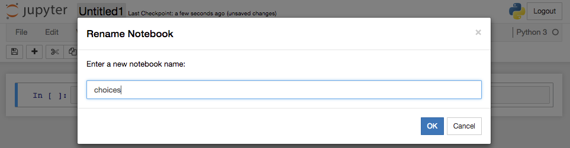

* Add a header

## Conditionals

* We often want the computer to do `<something>` **`if`** some condition is **true**
* To do this, we can use an `if` statement:

```python
if <condition>:
  <executed if condition is True>
```

```python
num = 37
if num > 100:
    print('greater')
print('done')
```

**LIVE DEMO**

## `if-else` statements

* An `if` statement executes code if the condition evaluates as `true`
* But what if the condition evaluates as `false`?

```python
if <condition>:
    <executed if condition is True>
else:
    <executed if condition is not True>
```

```python
num = 37
if num > 100:
    print('greater')
else:
    print('not greater')
print('done')
```

**LIVE DEMO**

## Conditional logic


## `if-elif-else`

* We can chain tests together using `elif` (`else if`)

```python
if <condition1>:
    <executed if condition1 is True>
elif <condition2>:
    <executed if condition2 is True and condition1 is not True>
else:
    <executed if no conditions True>
```

```python
num = -3
if num > 0:
    print(num, "is positive")
elif num == 0:
    print(num, "is zero")
else:
    print(num, "is negative")
```

**LIVE DEMO**

## Combining conditions

* Conditions can be combined using *Boolean Logic*
* Operators include `and`, `or` and `not`

```python
if (1 > 0) and (-1 > 0):
    print('both parts are true')
else:
    print('at least one part is false')
```

**LIVE DEMO**

##  Exercise 10 (5min)

What is the result of executing the code below?

```python
if 4 > 5:
    print('A')
elif 4 == 5:
    print('B')
elif 4 < 5:
    print('C')
```

1. `A`
2. `B`
3. `C`
4. `B` and `C`

## More operators

* Two useful condition operators are `==` (equality) and `in` (membership)

```python
print(1 == 1)
print(1 == 2)
print('a' in 'toast')
print('b' in 'toast')
print(1 in [1, 2, 3])
print(1 in range(3))
print(1 in range(2, 10))
```

**LIVE DEMO**

## List comprehensions

* We often want to loop over a list of elements and make a decision on the basis of whether the element meets some condition.
* *List comprehensions* offer a concise way to do this

```python
letters = 'abcdefghijklmnopqrstuvwxyz'
vowels = 'aeiou'
result = [l.upper() for l in letters if l in vowels]
print(result)
```

**LIVE DEMO**

# ANALYSING MULTIPLE FILES

## Start a new notebook


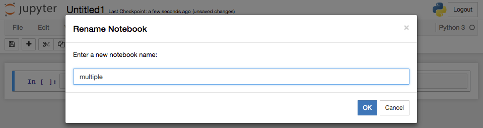

* Add a header

## Analysing multiple files

* We have several files of inflammation study data
* We want to visualise/analyse each of them
* We know how to load, visualise, loop over, and make decisions on the data
* But we need to know how to interact with the filesystem

## The `os` module

* The `os` module allows interaction with the filesystem
* `import os`

```python
%pylab inline

import matplotlib.pyplot
import numpy as np
import os
import seaborn
```

**LIVE DEMO**

## `os.listdir()`

* The `.listdir()` function lists the contents of a directory
* The list can be filtered with a `for` loop or *list comprehension*
* Our data is in the `'data'` directory

```python
os.listdir('data')
files = [f for f in os.listdir('data') if f.startswith('inflammation')]
print(files)
```

## `os.path.join()`

* The `os.listdir()` function only returns filenames, not the *path* (relative or absolute)
* `os.path.join()` builds a path from directory and filenames, suitable for the underlying OS

```python
print(os.path.join('data', 'inflammation-01.csv'))
```

**LIVE DEMO**

## Visualising the data

Now we have all the tools we need to load all the inflammation data files, and visualise the mean, minimum and maximum values in an array of plots.

* list of paths to the data files with `os` and a *list comprehension*
* load data from a file with `np.loadtxt()`
* calculate summary statistics with `mp.mean()`, `np.max()`, etc.
* create figures with `matplotlib`
* create arrays of figures with `.add_subplot()`

## Visualisation code

```python
filenames = [os.path.join('data', f) for f in os.listdir('data')
             if f.startswith('inflammation')]
             
for f in filenames:
    print(f)

    data = np.loadtxt(fname=f, delimiter=',')
    
    fig = matplotlib.pyplot.figure(figsize=(10.0, 3.0))
    
    axes1 = fig.add_subplot(1, 3, 1)
    axes2 = fig.add_subplot(1, 3, 2)
    axes3 = fig.add_subplot(1, 3, 3)
    
    axes1.set_ylabel('average')
    axes1.plot(np.mean(data, axis=0))
    
    axes2.set_ylabel('max')
    axes2.plot(np.max(data, axis=0))
    
    axes3.set_ylabel('min')
    axes3.plot(np.min(data, axis=0))
    
    fig.tight_layout()
    matplotlib.pyplot.show()
```

**LIVE DEMO**