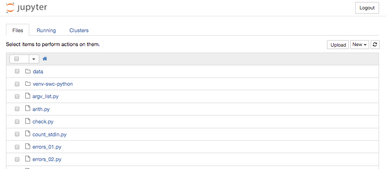
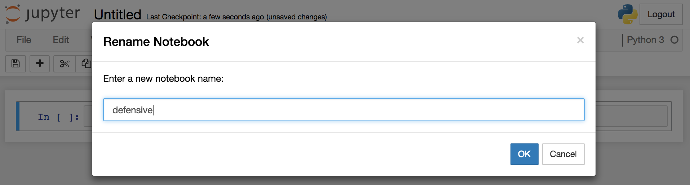

# Introduction

## Etherpad

Please use the Etherpad to take notes/share code, ask questions and explore

* [http://pad.software-carpentry.org/2017-05-18-standrews](http://pad.software-carpentry.org/2017-05-18-standrews)

## Why are we here?

### Learn basic concepts of programming

* **How to solve problems in your research by…**
  * Building functions
  * Automating tasks
* **Good Coding Practice**
  * Functions
  * Defensive Programming

## XKCD


## What are we doing?

### Analysing experimental data

* Effectiveness of a new treatment for arthritis
* Several patients, recording inflammation on each day
* Tabular (comma-separated) data

### We're going to improve our code

* **AUTOMATION**, **REUSE**, **SHARING**
* **FUNCTIONS**, **DOCUMENTATION**
* **DEFENSIVE PROGRAMMING**

# Setup

## Setting up

Before we begin… 

* **return to our neat working environment**

```bash
cd ~/Desktop
cd python-novice-inflammation
```

**LIVE DEMO**

## Starting `Jupyter`

At the command-line, start `Jupyter` notebook:

```bash
jupyter notebook
```

## `Jupyter` landing page




# FUNCTIONS

## Motivation


* We have code to plot values of interest from multiple datasets
* **BUT** the code is long and complicated
* It's not flexible enough to deal with thousands of files
* We can't modify it easily 
* **SO** we will package our code for reuse: **FUNCTIONS**

## What is a function?

* Functions in code work like mathematical functions

$$y = f(x)$$

* $f()$ is the function
* $x$ is an input (or input*s*)
* $y$ is the returned value, or output(s)

* The output $y$ depends in some way on the value of $x$ - defined by $f()$.
* **Not all functions in code take an input, or produce a usable output, but the principle is generally the same.**

## My first function

* `fahr_to_kelvin()` to convert Fahrenheit to Kelvin

$$f(x) = ((x - 32) \times \frac{5}{9}) + 273.15$$


**LIVE DEMO**

## Create a new notebook


## Create the function

* `fahr_to_kelvin()` to convert Fahrenheit to Kelvin

$$f(x) = ((x - 32) \times \frac{5}{9}) + 273.15$$


## Calling the function

* Calling `fahr_to_kelvin()` is the same as calling any other function

```python
print('freezing point of water:', fahr_to_kelvin(32))
print('boiling point of water:', fahr_to_kelvin(212))
```


## Create a new function

```python
def kelvin_to_celsius(temp):
  return temp - 273.15
```

```python
print('freezing point of water', kelvin_to_celsius(273.15))
```

## Composing functions

* Composing `Python` functions works like mathematical functions: $y = f(g(x))$
* We could convert F (`temp_f`) to C (`temp_c`) by executing the code:

```python
temp_c = kelvin_to_celsius(fahr_to_kelvin(temp_f))
```

**LIVE DEMO**


## New functions from old

* We can wrap this composed function inside a new function: `fahr_to_celsius`:

```python
def fahr_to_celsius(temp_f):
    return kelvin_to_celsius(fahr_to_kelvin(temp_f))
print('freezing point of water in Celsius:', fahr_to_celsius(32.0))
```

* **This is how programs are built: combining small bits into larger bits until the function we want is obtained**

**LIVE DEMO**

##  Exercise 01 (10min)

Can you write a function called `outer()` that:

* takes a single `string` *argument*
* returns a string comprising only the first and last characters of the input, e.g.

```python
print(outer("helium"))
hm
```


## Scope

* Variables defined within a function, including parameters, are not 'visible' outside the function
* This is called *function scope*

```python
a = "Hello"

def my_fn(a):
  a = "Goodbye"

my_fn(a)  
print(a)
```

**LIVE DEMO**

##  Exercise 02 (10min)

What would be printed if you ran the code below?

```python
a = 3
b = 7

def swap(a, b):
    temp = a
    a = b
    b = temp

swap(a, b)
print(b, a)
```

1. `7 3`
2. `3 7`
3. `3 3`
4. `7 7`


# ANALYSIS

## Tidying Up

* Now we can write functions
* Let's make the inflammation analysis easier to reuse: one function per operation
* Open the `files.ipynb` notebook from the first lesson
* **What operations should be put into functions?**

## `analyse()`

* We'll write a function called `analyse()` that plots the data

```python
def analyze(data):
    fig = matplotlib.pyplot.figure(figsize=(10.0, 3.0))

    axes1 = fig.add_subplot(1, 3, 1)
    axes2 = fig.add_subplot(1, 3, 2)
    axes3 = fig.add_subplot(1, 3, 3)

    axes1.set_ylabel('average')
    axes1.plot(numpy.mean(data, axis=0))

    axes2.set_ylabel('max')
    axes2.plot(numpy.max(data, axis=0))

    axes3.set_ylabel('min')
    axes3.plot(numpy.min(data, axis=0))

    fig.tight_layout()
    matplotlib.pyplot.show()
```

**LIVE DEMO**

## `detect_problems()`

* We noticed that some data was questionable
* This function spots problems with the data

```python
def detect_problems(data):
    if numpy.max(data, axis=0)[0] == 0 and numpy.max(data, axis=0)[20] == 20:
        print('Suspicious looking maxima!')
    elif numpy.sum(numpy.min(data, axis=0)) == 0:
        print('Minima add up to zero!')
    else:
        print('Seems OK!')
```

**LIVE DEMO**

## Code reuse

* Loop over the files and `analyse()` and `detect_problems()`

```python
for file in files:
    print(file)
    data = numpy.loadtxt(fname=file, delimiter=',')
    detect_problems(data)
    analyse(data)         
```


## Good code pays off

### Why should I bother?

* After 6 months, the referee report arrives and you need to rerun experiments
* Another student is continuing the project
* Some random person reads your article and asks for the code
* Helps spot errors quickly
* Clarifies structure in your mind as well as in the code
* Saves you time in the long run! ("Future You" will back this up)

# TESTING AND DOCUMENTATION

## Motivation

* Once written, functions are reused
* Functions might be reused without further checks
* When functions are written:
    * test for correctness 
    * document their function
* Example: centring a numerical array

## Create a New Notebook

* Add the function

```python
def centre(data, desired):
    return (data - np.mean(data)) + desired
```

**LIVE DEMO**

## Test datasets

* We could try `centre()` on real data
    * but we don't know the answer!
* Use `numpy` to create an artificial dataset

```python
z = np.zeros((2, 2))
print(centre(z, 3.0))
```

**LIVE DEMO**

## Real data

* On real data…

```python
data = numpy.loadtxt(fname='data/inflammation-01.csv', delimiter=',')
print(centre(data, 0))
```

* But how do we know it worked?

**LIVE DEMO**

## Check properties

* We can check properties of the original and centred data
  * `mean`, `min`, `max`, `std`

```python
centred = centre(data, 0)
print('original min, mean, and max are:', numpy.min(data), numpy.mean(data), numpy.max(data))
print('min, mean, and max of centered data are:', numpy.min(centred),
      numpy.mean(centred), numpy.max(centred))
print('std dev before and after:', numpy.std(data), numpy.std(centred))      
```

**LIVE DEMO**

## Default arguments

* The `centre()` function *requires* two arguments
* We can specify a *default* argument in how we define the function

```python
def centre(data, desired=0.0):
    """Returns the array in data, recentered around the desired value.
    
    Example: centre([1, 2, 3], 0) => [-1, 0, 1]
    """
    return (data - np.mean(data)) + desired
    centre(data, 0.0)
    centre(data, desired=0.0)
    centre(data)
```

**LIVE DEMO**

## Documenting functions

* Writing comments in the code (using the hash `#`) is a good thing
* `Python` provides for *docstrings*
    * These go after the function definition
    * Hook into `Python`'s help system
    
```python
def centre(data, desired):
    """Returns the array in data, recentered around the desired value."""
    return (data - numpy.mean(data)) + desired

help(centre)
```

**LIVE DEMO**


##  Exercise 03 (15min)

Can you write a function called `rescale()` that

* takes an array as input
* returns an array with values scaled in the range [0.0, 1.0]
* has an informative docstring
* **HINT:** If `L` and `H` are the lowest and highest values in the original array, then the replacement for a value `v` should be `(v-L) / (H-L)`.


# ERRORS AND EXCEPTIONS

## Create a new notebook


## Errors

* Programming: the process of making errors and correcting them until the code works
* **All** programmers make errors
* Identifying, fixing, and coping with errors is a valuable skill

## Traceback

* `Python` tries to tell you what has gone wrong by providing a `traceback`

```python
def favourite_ice_cream():
    ice_creams = [
        "chocolate",
        "vanilla",
        "strawberry"
    ]
    print(ice_creams[3])

favourite_ice_cream()
```

**LIVE DEMO**

## Parts of a traceback

```python
---------------------------------------------------------------------------
IndexError                                Traceback (most recent call last)
<ipython-input-1-b0e1f9b712d6> in <module>()
      8     print(ice_creams[3])
      9 
---> 10 favourite_ice_cream()

<ipython-input-1-b0e1f9b712d6> in favourite_ice_cream()
      6         "strawberry"
      7     ]
----> 8     print(ice_creams[3])
      9 
     10 favourite_ice_cream()

IndexError: list index out of range
```

* (mostly, you can just look at the last couple of levels)

**LIVE DEMO**

## Syntax errors

* *Logic* errors occur when the code is 'correct' but does something 'illegal'
* *Syntax* errors occur when the code is not understandable as `Python`

```python
def some_function()
    msg = "hello, world!"
    print(msg)
     return msg
```

**LIVE DEMO**

## Syntax traceback

```python
  File "<ipython-input-3-dbf32ad5d3e8>", line 1
    def some_function()
                       ^
SyntaxError: invalid syntax
```

**LIVE DEMO**

## Fixed?

```python
def some_function():
    msg = "hello, world!"
    print(msg)
     return msg
```

**LIVE DEMO**

## Not quite

```python
  File "<ipython-input-4-e169556d667b>", line 4
    return msg
    ^
IndentationError: unexpected indent
```

**LIVE DEMO**

## Name errors

* `NameError`s occur when a variable is not defined in scope
* (often due to a typo!)

```python
print(a)

---------------------------------------------------------------------------
NameError                                 Traceback (most recent call last)
<ipython-input-5-c5a4f3535135> in <module>()
----> 1 print(a)

NameError: name 'a' is not defined
```

**LIVE DEMO**

## Index Errors

* If you try to access an element of a collection that does not exist, you'll get an `IndexError`

```python
letters = ['a', 'b', 'c']
print("Letter #1 is", letters[0])
print("Letter #2 is", letters[1])
print("Letter #3 is", letters[2])
print("Letter #4 is", letters[3])

Letter #1 is a
Letter #2 is b
Letter #3 is c
---------------------------------------------------------------------------
IndexError                                Traceback (most recent call last)
<ipython-input-7-656a22fa6ec5> in <module>()
      3 print("Letter #2 is", letters[1])
      4 print("Letter #3 is", letters[2])
----> 5 print("Letter #4 is", letters[3])

IndexError: list index out of range
```

**LIVE DEMO**

##  Exercise 04 (15min)

* Can you read the code below, and (without running it) identify what the errors are?
* Can you fix all the errors so the code prints `abbabbabba`?

```python
for number in range(10):
    # use a if the number is a multiple of 3, otherwise use b
    if (Number % 3) = 0:
        message = message + a
    else:
        message = message + "b"
print(message)
```


# DEFENSIVE PROGRAMMING

## Create a new notebook




## Defensive programming

* We've focused on the basics of building code: variables, loops, functions, etc.
* We've *not* focused on whether the code is 'correct'
* *Defensive programming* is expecting your code to have mistakes, and guarding against them
* **Write code that checks its own operation**

## Assertions

* Assertions are a `Pythonic` way to see if code runs correctly
    * 10-20% of the `Firefox` source code is checks on the rest of the code!
* We `assert` that a *condition* is `True`
    * If it's `True`, the code may be correct
    * If it's `False`, the code is **not** correct
    
```python
assert <condition>, "Some text describing the problem"
```

## Example assertion

```python
numbers = [1.5, 2.3, 0.7, -0.001, 4.4]
total = 0.0
for n in numbers:
    assert n > 0.0, 'Data should only contain positive values'
    total += n
print('total is:', total)
```

**QUESTION:** What does this assertion do?

## When to use assertions

* *preconditions* - must be true at the start of an operation
* *postcondition* - guaranteed to be true when operation completes
* *invariant* - something true at a particular point in code

```python
def normalise_rectangle(rect):
    """Normalises a rectangle to the origin, longest axis 1.0 units."""
    x0, y0, x1, y1 = rect
    
    dx = x1 - x0
    dy = y1 - y0
    
    if dx > dy:
        scaled = float(dx) / dy
        upper_x, upper_y = 1.0, scaled
    else:
        scaled = float(dx) / dy
        upper_x, upper_y = scaled, 1.0
        
    return (0, 0, upper_x, upper_y)
```

## Preconditions

* must be true at the start of an operation or function
* Here, we want to ensure that `rect` has four values

```python
def normalise_rectangle(rect):
    """Normalises a rectangle to the origin, longest axis 1.0 units."""
    assert len(rect) == 4, "Rectangle must have four co-ordinates"
    x0, y0, x1, y1 = rect
    
    dx = x1 - x0
    dy = y1 - y0
    
    if dx > dy:
        scaled = float(dx) / dy
        upper_x, upper_y = 1.0, scaled
    else:
        scaled = float(dx) / dy
        upper_x, upper_y = scaled, 1.0
        
    return (0, 0, upper_x, upper_y)
```

## Postconditions

* must be true at the end of an operation or function.
* Here, we want to assert that the upper x and y values are in the range [0, 1]

```python
def normalise_rectangle(rect):
    """Normalises a rectangle to the origin, longest axis 1.0 units."""
    assert len(rect) == 4, "Rectangle must have four co-ordinates"
    x0, y0, x1, y1 = rect
    
    dx = x1 - x0
    dy = y1 - y0
    
    if dx > dy:
        scaled = float(dy) / dx
        upper_x, upper_y = 1.0, scaled
    else:
        scaled = float(dx) / dy
        upper_x, upper_y = scaled, 1.0
        
    assert 0 < upper_x <= 1.0, "Calculated upper x-coordinate invalid"
    assert 0 < upper_y <= 1.0, "Calculated upper y-coordinate invalid"    
        
    return (0, 0, upper_x, upper_y)
```

## Notes on assertions

* Assertions help understand programs: they declare what the program should be doing
* Assertions help the person reading the program match their understanding of the code to what the code expects
* *Fail early, fail often*
* Turn bugs into assertions or tests: if you've made the mistake once, you might make it again

# Test-driven development

## A problem

### We want to write a function…
* Input: a set of ranges (s0, e0), (s1, e1), …
* Output: the largest range included in all the input ranges
  


## A novice's approach

1. Write a function: `range_overlap()`
2. Call the function interactively on two or three test inputs
3. If the answer is wrong, fix the function

### Is there anything wrong with this?

## A programmer's approach

1. Write a short function for each test **first**
2. Write a `range_overlap()` function that should pass those tests
3. If any answers are wrong, fix it and re-run the test functions

### Why do it this way?

## Test functions

* Here are three test functions for a hypothetical `range_overlap()` function

1. single range returns itself
2. simple overlap of two ranges
3. simple overlap of three ranges

```python
assert range_overlap([ (0.0, 1.0) ]) == (0.0, 1.0)
assert range_overlap([ (2.0, 3.0), (2.0, 4.0) ]) == (2.0, 3.0)
assert range_overlap([ (0.0, 1.0), (0.0, 2.0), (-1.0, 1.0) ]) == (0.0, 1.0)
```

### What are we missing?

## Make the test function

* Wrap the tests in a single function

```python
def test_range_overlap():
    assert range_overlap([(0.0, 1.0)]) == (0.0, 1.0)
    assert range_overlap([(2.0, 3.0), (2.0, 4.0)]) == (2.0, 3.0)
    assert range_overlap([(0.0, 1.0), (0.0, 2.0), (-1.0, 1.0)]) == (0.0, 1.0)
    assert range_overlap([(0.0, 1.0), (5.0, 6.0)]) == None
    assert range_overlap([(0.0, 1.0), (1.0, 2.0)]) == None
```

## Write `range_overlap()`

```python
def range_overlap(ranges):
    """Return common overlap among a set of (low, high) ranges."""
    lowest = 0.0
    highest = 1.0
    for (low, high) in ranges:
        lowest = max(lowest, low)
        highest = min(highest, high)
    return (lowest, highest)
```

* Test with `test_range_overlap()`

##  Exercise 05 (15min)

Add the test:

```python
assert range_overlap([]) == None
```

Can you fix `range_overlap()`?

